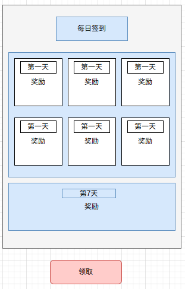
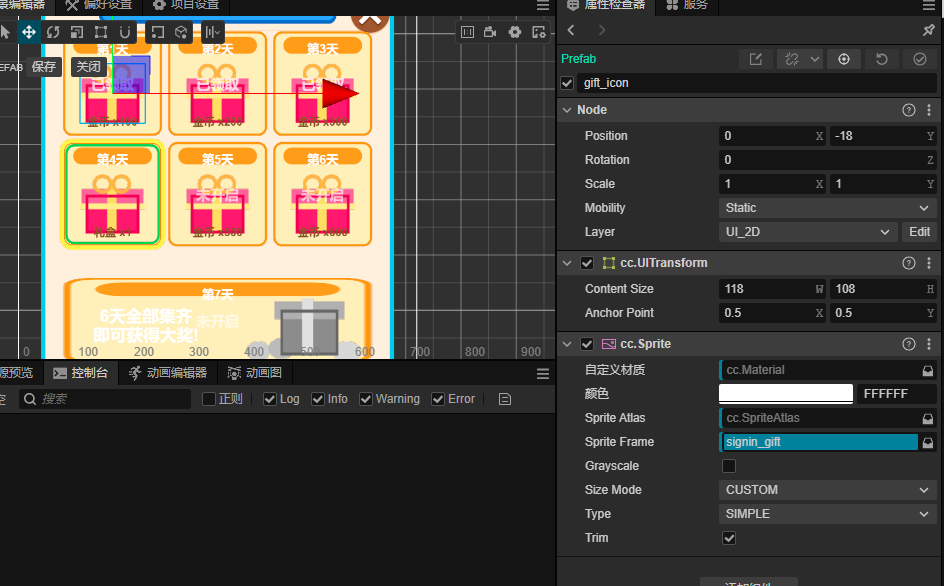
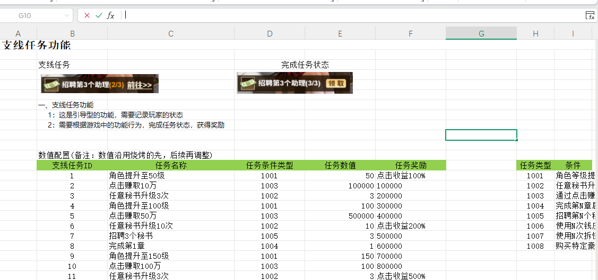
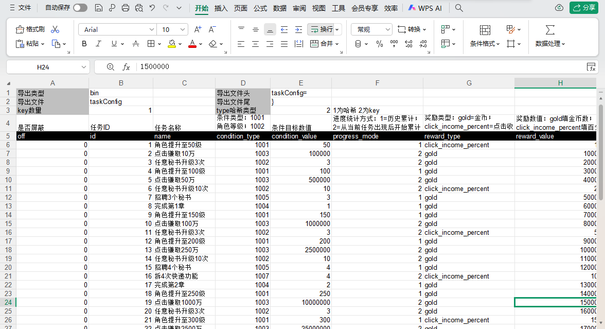

# Agent Harness Cocos 游戏客户端工程：Cocos CLI 工作流与 Codex Agent 协作验证


这是一个基于 Cocos CLI + TypeScript 的 AI Harness 最小客户端工程，用于验证 Codex / Agent 在 Cocos Creator 3.8.8 游戏项目中的 AGENTS 路由、Skills 分层、Karpathy Wiki 知识沉淀、轻量 RAG 检索、MCP 接入、Prefab/UI、逻辑代码和数值表生成，以及 Planner-Generator-Evaluator 模块化检查闭环。客户端运行时只保留 Loading -> Game -> Welcome，用最小工程证明大型游戏 AI 协作开发流程。

当前客户端只保留：

- `Loading.scene -> Game.scene -> Welcome` 最小启动链路。
- Cocos 框架核心、公共弹窗、欢迎界面和认证演示窗口。
- Harness 路由文档、框架级 Skills、项目级 Skills、workflow 说明和 `.codex/wiki/` 知识沉淀骨架。

不保留旧编辑器、策划/美术/工具链目录、外部 MCP 服务产物、向量索引、embedding 缓存、数据库、检索服务或第三方工具源码。核心部分代码由于涉及商业机密，暂选未公开。

## 项目目标

本仓库不是完整商业游戏工程，而是一个可提交、可检索、可验证的 AI Harness 最小样板：

- **GitHub 展示**：README 能独立说明项目定位、版本要求、目录职责和协作流程。
- **AI Harness 认证**：通过 `AGENTS.md`、Skills、workflows 和最小客户端验证 Agent 任务路由。
- **Karpathy Wiki 知识沉淀**：通过 `.codex/wiki/` 维护 LLM 可持续整理的 Markdown 知识层，把稳定理解沉淀到可复用页面。
- **Cocos MCP 测试**：可选接入 `cocos-cli 0.0.1-alpha.22` 启动本机 MCP 服务，辅助项目检查和工具实验。
- **轻量 RAG 测试**：把 README、AGENTS、Skills、Wiki、overview 和必要代码作为外部检索知识源；当前是流程级检索验证，不是 embedding-based RAG 系统。
- **大型游戏开发模型演示**：把策划意图、美术资源、客户端代码、配置表和 Agent 评估流程串成可扩展协作模型。

## 环境要求

| 工具 | 版本 | 用途 |
| --- | --- | --- |
| Node.js | `>= 22.17.0` | 本机工具链、TypeScript、可选 MCP 测试 |
| npm | `10.x` | 安装项目开发依赖或全局工具 |
| Cocos Creator / Engine | `3.8.8` | 打开和运行客户端工程 |
| TypeScript | `5.4.5` | 当前客户端 devDependency |
| cocos-cli | `0.0.1-alpha.22` | 可选 MCP / Harness 实验工具 |

`cocos-cli` 是外部工具，不是客户端运行时依赖；不要把 `cocos-cli` 源码、MCP 服务产物或 `node_modules` 提交到本仓库。

## 最小启动链路

客户端启动链路固定为：

```text
Loading.scene
  -> Loading.ts
  -> App.SwitchScene("Game")
  -> Game.scene
  -> Gaming.ts
  -> App.initialize()
  -> App.ShowWelcome()
```

压缩图：

```text
Loading.scene -> Loading.ts -> Game.scene -> Gaming.ts -> App.ShowWelcome()
```

RAG、MCP、Planner、Generator、Evaluator 都是 Harness / Agent 层说明，不进入 Cocos 客户端运行时，也不改变 `Loading -> Game -> Welcome`。

## 仓库结构

```text
.
|-- AGENTS.md
|-- README.md
|-- LICENSE
|-- .codex/
|   |-- AGENTS.md
|   |-- skills/
|   |-- workflows/
|   `-- wiki/
|       |-- sources.md
|       |-- index.md
|       |-- log.md
|       `-- core/
`-- cocos_game_testing/
    |-- AGENTS.md
    |-- AI_PROJECT_OVERVIEW.md
    |-- assets/
    |-- skills/
    |-- package.json
    `-- cocos.config.json
```

| 路径 | 职责 |
| --- | --- |
| `AGENTS.md` | 仓库入口路由，只说明启动时继续读取哪些规则。 |
| `.codex/AGENTS.md` | 框架级 Harness / Skills 边界，适合复用到后续 Cocos 项目。 |
| `.codex/skills/` | 框架级 Skills：项目 Harness、核心运行时、窗口模块、Prefab、配置表等通用规则。 |
| `.codex/workflows/` | 框架级 workflow：RAG 检索链路和 Planner / Generator / Evaluator 架构流程。 |
| `.codex/wiki/` | Karpathy Wiki 风格的 LLM-maintained Markdown 知识库。 |
| `.codex/wiki/sources.md` | Raw Sources 清单，记录哪些仓库文件是可信源材料。 |
| `.codex/wiki/index.md` | Wiki 入口索引，说明当前已规划和已维护的知识页面。 |
| `.codex/wiki/log.md` | Wiki 初始化、整理、更新和维护记录。 |
| `.codex/wiki/core/` | 由 `cocos_game_testing/assets/script/funsan/core/**/*.ts` 编译出的框架理解页面目录。 |
| `cocos_game_testing/` | 当前最小 Cocos Creator 客户端工程。 |
| `cocos_game_testing/AGENTS.md` | 客户端目录内 Agent 启动规则。 |
| `cocos_game_testing/AI_PROJECT_OVERVIEW.md` | 当前客户端概览和项目级路由。 |
| `cocos_game_testing/skills/` | 当前最小客户端项目规则。 |
| `LICENSE` | 当前仓库的 MIT License。 |

## AGENTS 作用

Agent 进入仓库后按目录作用域读取规则：

```text
AGENTS.md
  -> .codex/AGENTS.md
  -> cocos_game_testing/AGENTS.md
  -> cocos_game_testing/AI_PROJECT_OVERVIEW.md
  -> matched Skill
```

- 根 `AGENTS.md`：只做入口路由，不放具体实现规则。
- `.codex/AGENTS.md`：定义框架层边界，避免把当前项目业务写进可复用规则。
- `cocos_game_testing/AGENTS.md`：定义客户端项目边界，说明当前只保留最小认证链路。
- 如果规则冲突，以更靠近目标文件的 `AGENTS.md` 为准。

## Skills 分层

Skills 是 Agent 执行任务时的细分操作手册。README 只说明如何路由，具体规则以对应 `SKILL.md` 为准。

框架级 Skills 位于 `.codex/skills/`：

- `cocos-project-harness`：Cocos 3.8.8 Harness、两场景链路、环境检查和目录边界。
- `cocos-core-runtime`：`App`、`XComponent`、Manager、事件、持久化数据等核心运行时规则。
- `cocos-window-module`：普通窗口模块、`WindowName`、`ResDefine`、`WindowBase`、`XButton` 和挂载式 UI。
- `cocos-prefab-authoring`：Prefab 节点、组件、Widget、绑定、资源占位和检查规则。
- `cocos-config-table`：配置表、导出、注册、字段说明和验证流程。

项目级 Skills 位于 `cocos_game_testing/skills/`：

- `video-game-project`：当前最小客户端的启动链路、安全边界和资源保留原则。

新增框架通用规则时写入 `.codex/skills/`；新增当前客户端专用规则时写入 `cocos_game_testing/skills/`。

## Harness Workflow

Harness 的 Agent 架构流程见 [.codex/workflows/HARNESS_AGENT_FLOW.md](.codex/workflows/HARNESS_AGENT_FLOW.md)。

核心闭环：

```text
User Request
  -> RAG Context
  -> Planner
  -> Generator
  -> Evaluator
  -> Result / Revision
```

三个流程角色：

- **Planner**：读取 RAG 命中的上下文，明确目标、范围、约束、假设和验收标准。
- **Generator**：按计划修改文档、代码、Prefab、资源或配置，保持输出可验证。
- **Evaluator**：按 Test Plan 检查引用、路径、资源、类型、范围和回归风险。

默认是单会话串行扮演三个角色；复杂任务可用 subagent 分担 Generator 或 Evaluator；只有认证演示需要隔离职责时，才模拟三个独立会话。

## Karpathy Wiki 知识沉淀模型

Karpathy Wiki 是本仓库的长期知识沉淀层。它不替代源码、AGENTS、Skills 或 workflows，而是把这些 Raw Sources 中稳定、可复用的理解整理成 Markdown 知识页面，供后续 Agent 查询和维护。

基础关系：

```text
Raw Sources
  -> Compiled Wiki
  -> Agent Query / Maintenance
```

首批 Raw Sources：

```text
README.md
AGENTS.md
.codex/AGENTS.md
.codex/workflows/
.codex/skills/
cocos_game_testing/AGENTS.md
cocos_game_testing/AI_PROJECT_OVERVIEW.md
cocos_game_testing/skills/
cocos_game_testing/assets/script/funsan/core/**/*.ts
necessary scene / prefab / module files
```

`cocos_game_testing/assets/script/funsan/core/**/*.ts` 是 `framework-source`。它包含 `App`、`Global`、`AppData`、`AppPlatformSDK`、Manager、工具类、基础组件、窗口系统、资源加载、声音、事件和适配规则。Wiki 应把它整理成框架边界、公共 API 使用规则、Manager 职责、组件约束、窗口生命周期、平台和持久化约定、高风险文件清单，而不是逐函数复述源码。

`sources.md` 记录可信源材料；`index.md` 作为 Wiki 入口；`log.md` 记录知识整理和维护过程。当前只建立最小骨架，后续再按任务逐步生成 `core/runtime-overview.md`、`core/window-system.md` 等页面。

## RAG 检索链路

RAG 说明见 [.codex/workflows/RAG_TEST_FLOW.md](.codex/workflows/RAG_TEST_FLOW.md)。

RAG 的核心是 Retrieval、Augmented、Generation：先取回相关资料，把资料放进上下文，再基于上下文回答或生成。embedding 只是 Retrieval 的一种实现方式，不是 RAG 的必要条件。

当前项目没有 embedding、向量库、索引服务、数据库或自动检索服务。当前 RAG 是流程级、文档级的轻量检索验证链路，不进入 Cocos 客户端运行时代码。它依赖 AGENTS 路由、README、Wiki、Skills、workflows、关键词搜索和必要源码读取。

当前检索增强流程：

```text
User Question
  -> README / AGENTS / RAG_TEST_FLOW routing
  -> Wiki / Skills / Workflows / Source Files
  -> Answer / Plan / Verification
```

推荐知识源：

```text
README.md
  -> AGENTS.md
  -> .codex/AGENTS.md
  -> .codex/wiki/
  -> .codex/workflows/
  -> .codex/skills/
  -> cocos_game_testing/AGENTS.md
  -> cocos_game_testing/AI_PROJECT_OVERVIEW.md
  -> cocos_game_testing/skills/
  -> necessary code / prefab / resource paths
```

RAG 回答应能区分：

- MCP：可选工具接入。
- Karpathy Wiki：长期沉淀和维护理解。
- 轻量 RAG：按问题检索上下文并验证命中。
- embedding RAG：未来资料量变大后的可选召回方式，当前未实现。
- Cocos 客户端运行时：仍只保留 `Loading -> Game -> Welcome`。

## Cocos MCP 与 cocos-cli

本工程可选使用 `cocos-cli 0.0.1-alpha.22` 测试 Cocos MCP 和 Harness 工具接入。它不是运行时依赖，也不是稳定构建链路的硬要求。

常用命令：

```powershell
cocos.cmd --version
cocos.cmd info --project .\cocos_game_testing
cocos.cmd start-mcp-server --project .\cocos_game_testing --port 9527
codex.cmd mcp add cocos --url http://127.0.0.1:9527/mcp
codex.cmd mcp get cocos
```

PowerShell 下优先使用 `cocos.cmd`，避免直接执行 `cocos` 时触发脚本执行策略限制。若 MCP 服务实际输出的 endpoint 不是 `/mcp`，以服务打印的地址为准。

提交边界：

- 不提交 `cocos-cli` 源码。
- 不提交 MCP 服务产物。
- 不提交 `node_modules`。
- 不提交向量索引、embedding 缓存或数据库。

使用链路：

```text
User Request / Artwork / Feature Brief
  -> AGENTS.md routing
  -> Wiki / RAG lookup in README, Skills, Overview, Source
  -> Planner
  -> Generator
  -> Evaluator
  -> Cocos Creator verification
```

## 生成效果示例

### 开放排行榜系统：开发流程对比

以开放排行榜系统为例，传统开发需要手工写逻辑、搭 UI 预制体、绑定节点属性并反复检查，通常需要约 `3-7 天`。只有 AI 代码生成、但没有 Cocos CLI / Harness 时，逻辑代码可以较快生成，但 UI 预制体制作和核心属性挂载仍然麻烦，通常仍需要约 `1 天`。使用 Cocos CLI + Agent Harness 后，可以完成基础排版、核心属性挂载和逻辑生成，后期主要做资源对齐和代码检查，预计约 `1-3 小时`。

| 开发方式 | 主要流程 | 主要瓶颈 | 预计耗时 |
| --- | --- | --- | --- |
| 传统手工开发 | 需求理解 -> 手写 TS 逻辑 -> 手工搭 UI 预制体、配置表 -> 手工绑定节点属性 -> 手工调试 | 逻辑、Prefab、绑定和检查都依赖人工经验，重复劳动多 | `3-7 天` |
| 有 AI 但无 Cocos CLI / Harness | 需求理解 -> AI 生成 TS 逻辑、配置表 -> 手工搭 UI 预制体 -> 手工绑定节点属性 -> Cocos 内检查 | 代码生成变快，但 UI 预制体制作、属性挂载和项目规则校验仍然慢 | 约 `1 天` |
| Cocos CLI + Agent Harness | 需求/参考图 -> AGENTS / Skills / Wiki 上下文 -> Cocos CLI 辅助排版 -> 核心属性挂载 -> 逻辑生成、自动配置表 -> 资源对齐和代码检查 | 主要剩余工作是资源精修、视觉对齐和验收检查 | 约 `1-3 小时` |

这个对比展示的是 Harness 的核心价值：把重复性的窗口结构、Prefab 绑定、框架规则读取和验证流程标准化，让 Agent 从“只会写代码”升级为“能生成可检查的 Cocos 模块”。

本工程包含一个用于验证 Codex + Harness + Cocos Prefab 生成链路的“每日签到”窗口示例。它从参考图和线框图出发，由 Agent 生成窗口模块、Prefab 结构、绑定字段和专用资源，并在 Cocos Creator 中验证可挂载、可检查、可迭代。

示例提示词：

```text
按图创建一个模块窗口，功能需要对齐。
```


效果参考：



功能逻辑也生成，后期替换美术资源即可。直接运行效果：


示例提示词：

```text
按策划文案创建一个任务模块窗口和生成配置，按文档说明和参考图完成所有功能。
```


效果参考：



生成目标：

- 从线框布局生成 Cocos 窗口结构：标题、6 个普通签到格、第 7 天大奖区域、领取按钮。
- 按参考图补齐视觉方向：橙色标题、礼盒图标、当前第 4 天高亮、已领取/未开启状态。
- 使用 `XButton` 绑定按钮交互，重要节点通过 `@property` 挂载，不依赖运行时按名字查找。
- 缺失图片生成独立透明 PNG，放入 `assets/resources/assets/texture/signin/`。
- 复用公共 `com` 资源，不恢复旧业务资源体系。

示例链路：

```text
Reference Image / Wireframe
  -> Codex Requirement Understanding
  -> cocos-window-module Skill
  -> cocos-prefab-authoring Skill
  -> TypeScript Window Module
  -> Cocos Prefab + Mounted Components
  -> Cocos Creator Inspector Verification
```

当前仓库中的落地资源示例：

```text
cocos_game_testing/assets/resources/assets/texture/signin/signin_panel.png
cocos_game_testing/assets/resources/assets/texture/signin/signin_title.png
cocos_game_testing/assets/resources/assets/texture/signin/signin_card.png
cocos_game_testing/assets/resources/assets/texture/signin/signin_highlight.png
cocos_game_testing/assets/resources/assets/texture/signin/signin_gift.png
cocos_game_testing/assets/resources/assets/texture/signin/signin_grand_gray.png
cocos_game_testing/assets/resources/assets/texture/signin/signin_claim_btn.png
```

这个例子展示的是工程实践能力：Agent 不只是写 TypeScript，也要能根据图稿和线框生成可在 Cocos Creator Inspector 中检查、绑定和继续调整的模块窗口。

## 大型游戏开发模型

这个最小工程用于演示一种可扩展到大型游戏项目的 AI 协作模型：将策划、美术、客户端、工具、配置表和 Agent 评估统一到同一条可验证链路中。

```text
Design Intent / Assets / Code / Config
  -> Raw Sources
  -> Karpathy Wiki Knowledge
  -> Lightweight RAG / Direct Search
  -> Planner
  -> Generator
  -> Evaluator
  -> GitHub Review
  -> Wiki / Skill Update
  -> Next Iteration
```

在大型项目中，各层职责可扩展为：

- 策划输入：玩法、活动、剧情、奖励、配置表字段和验收标准。
- 美术输入：图片、图集、Prefab 占位、动画、音频和资源命名规则。
- 客户端实现：Cocos 场景、窗口模块、核心运行时、资源加载和平台适配。
- 工具链：配置导出、Prefab 生成、资源检查、构建检查和 MCP 辅助操作。
- Karpathy Wiki：把 README、AGENTS、Skills、workflow、项目 overview、`core` 源码和资源路径沉淀成可维护的 Markdown 知识。
- 轻量 RAG：按问题检索 Wiki、README、AGENTS、Skills、workflow、项目 overview、代码和资源路径。
- Agent 角色：Planner 制定计划，Generator 生成变更，Evaluator 独立检查结果。
- GitHub：承载提交、审查、认证材料和后续迭代记录。

当前仓库只实现最小认证客户端，不恢复旧业务模块；大型游戏模型用于说明 Harness 如何向真实生产项目扩展。

## 维护原则

- 保持 `Loading -> Game -> Welcome` 最小启动链路稳定。
- 新规则优先写入最匹配的 Skill 或 workflow，README 只保留 GitHub 展示所需的完整总览。
- 框架长期知识优先沉淀到 Skill、workflow 或 `.codex/wiki/`，避免散落在一次性对话里。
- `cocos_game_testing/assets/script/funsan/core/**/*.ts` 是框架基础源码；修改或新增模块前，应理解其 Manager、组件、窗口、资源、工具类、平台桥接和高风险文件约束。
- `assets/resources` 采用引用白名单策略，只保留启动链路、欢迎界面、公共窗口和认证模块实际引用的资源。
- 不重新引入旧影游玩法、vscene、编辑器、历史功能窗口或无关资源。
- 任何 MCP、RAG、Karpathy Wiki、Agent 编排说明都不得变成客户端运行时依赖。
- 不提交 embedding 缓存、向量索引、数据库、自动检索服务产物或外部工具源码。

## 快速检查

```powershell
node -v
npm -v
cocos.cmd --version
rg -n "Karpathy|Wiki|RAG|embedding|向量|sources.md|Raw Sources|core" README.md
rg --files .codex/wiki
rg -n "Karpathy|Wiki|RAG|embedding|向量|Planner|Generator|Evaluator" cocos_game_testing\assets -g "*.ts" -g "*.scene" -g "*.prefab"
```

如果最后一条命令因为 README 或 Wiki 更新而在运行时资源里出现新增引用，需要检查是否误把 Harness 文档概念写入客户端运行时代码。

## License

This repository is licensed under the [MIT License](LICENSE).
